### Hi there 👋 I am Gaurav Rai.

<!--
**rai-gaurav/rai-gaurav** is a ✨ _special_ ✨ repository because its `README.md` (this file) appears on your GitHub profile.

Here are some ideas to get you started:

- 🔭 I’m currently working on ...
- 🌱 I’m currently learning ...
- 👯 I’m looking to collaborate on ...
- 🤔 I’m looking for help with ...
- 💬 Ask me about ...
- 📫 How to reach me: ...
- 😄 Pronouns: ...
- ⚡ Fun fact: ...
-->

---

## :trophy: My GitHub Stats

<!--
  

    
  

-->

  
  
  

  
  
  

---
 
 ## :email: Find me on:

  

---

## 🧰 Languages and Tools:

  
  
  
  
  
  
  
  
  
  
  
  

---
